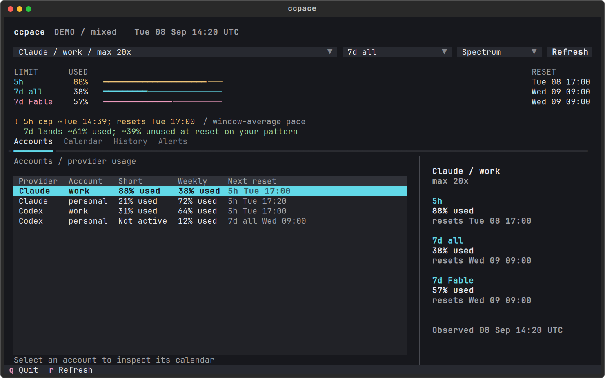
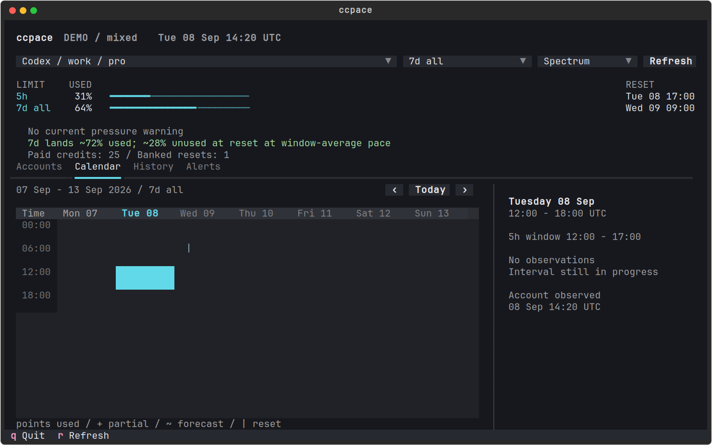
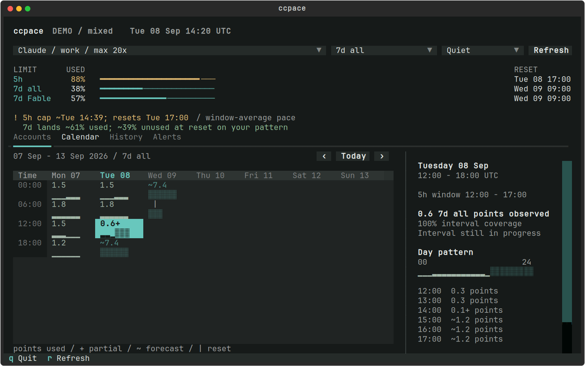
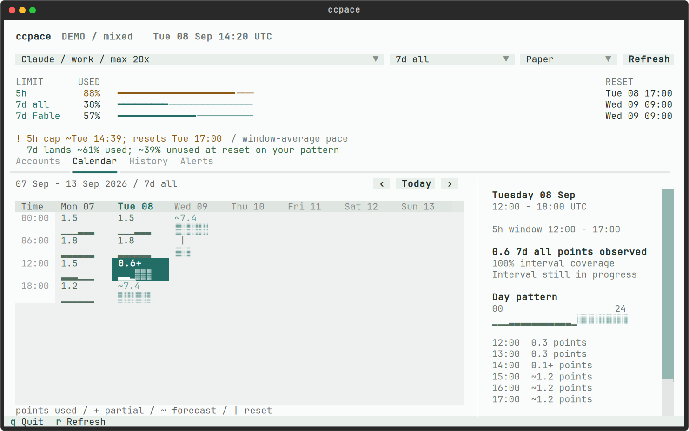
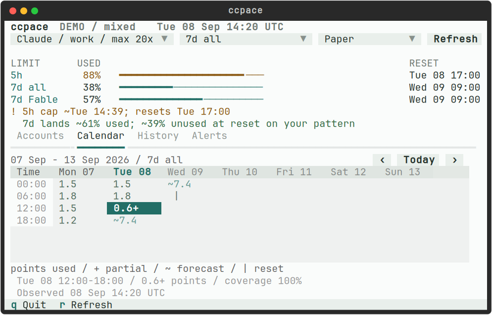
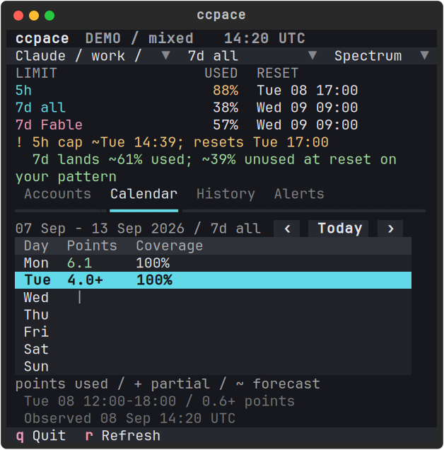

# Usage calendar

Accounts compares Claude and Codex without combining their allowances.
The screenshots below use synthetic data only.



The week grid combines interval totals with small hourly strips. Selecting
an interval shows the day's pattern and the underlying observations.

Unavailable values remain blank. The inspector explains missing history,
unavailable forecasts, and future quota periods when selected. Observed
zero remains `0.0`; `+` marks a partial observed amount.


The ruler is local clock time. A 5h window can be inactive while weekly
history remains available. Codex reset inventory and paid credits are
shown separately when the provider supplies them.



Spectrum is the default dark palette. Quiet softens the accents; Paper
uses a light background. Select a palette with the theme picker or `Ctrl+t`.





## Compact layouts

At 80 columns the inspector moves below the calendar. Narrower terminals
use a daily agenda with the same selection and data.





## Run this checkout

```sh
make demo
./bin/ccpace --calendar
```

Demo mode has no account access or notification delivery. `d` cycles cap,
stale, cold-history, reset, paid-credit, rebase, and missing-short-window
scenarios. `Ctrl+t` cycles Spectrum, Quiet, and Paper; `q` quits.

Regenerate these synthetic captures with JetBrains Mono installed:

```sh
uv run --script t/capture_calendar.py --output docs/calendar-previews
```
