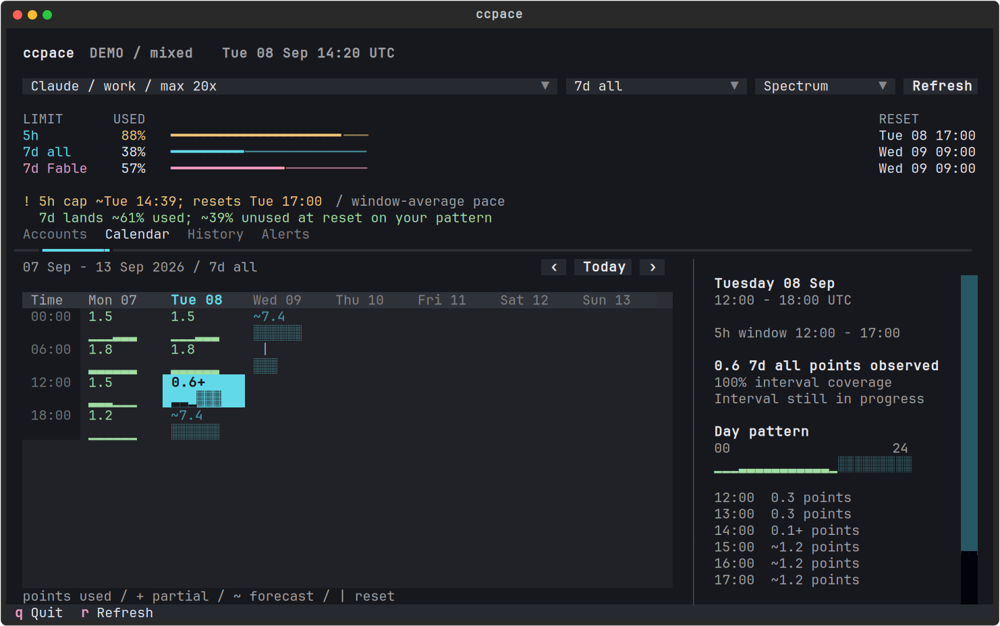

# Usage calendar

Available in ccpace 0.10.0 as the default interactive view. Multiple
accounts open an Accounts overview; `--once` and `--json` are noninteractive.
All screen values and account labels below are synthetic.

The implementation provides one calendar view with interval totals
and hourly patterns, live collection, synthetic scenarios, day inspection,
period history, and persistent warning transitions. See the
[calendar preview](calendar-previews/README.md) and
[usage reference](../README.md#calendar).

The design below also records further work: user-configurable warning
thresholds. The experiment currently uses 20/15
weekly percentage points for surplus entry/recovery and two fresh
observations for forecast changes. Those defaults are provisional, not
claimed as calibrated from workload replay. Spectrum, Quiet, and Paper
are selected with `--theme` or `CCPACE_THEME`; the picker and `Ctrl+t`
switch during a run. Light `COLORFGBG` selects Paper when no theme is set.
`NO_COLOR` is honored.

## The problem

An account can exhaust its 5h allowance repeatedly and still finish the
week with useful 7d capacity unused. The calendar must make both conditions
visible together: pressure during a sitting, and how usage is distributed
across the week. A single account health color cannot describe that state.

The first experiment watches, explains, and warns. It does not pause,
resume, launch, reroute, or steer agents. Task scheduling, reservations,
and personal-calendar integration are outside this experiment.

## Subscription limits are the domain

These are overlapping constraints on usage, not interchangeable balances.

| Meter | What it constrains | What a reset changes |
| --- | --- | --- |
| Claude 5h | Included usage in the current short window | That window's allowance; not the weekly counters |
| Claude 7d, all models | Aggregate included usage over its weekly window | The aggregate weekly allowance |
| Claude 7d, Fable or another scope | Included usage for the reported model/surface | That scope's allowance at its own reported reset |
| Paid usage credits | The paid continuation path, with its own balance and spending controls | Follow the reported credit/spend contract, not the 5h clock |

A Fable request can consume the short, aggregate weekly, and Fable weekly
allowances together. Switching models does not restore the shared 5h or
7d allowance. A scoped cap can bind while aggregate headroom remains.
Percentages have different denominators: never add them or interpret the
smallest remaining percentage as a common amount of work.

Claude's public documentation describes shared usage across product
surfaces, five-hour windows, and weekly limits. The statusline's observed
wire contract supplies the more specific `session`, `weekly_all`, and
`weekly_scoped` meters, including Fable. Label that distinction in source
documentation; do not pretend the public documentation specifies Fable's
capacity or its conversion to aggregate quota.

Codex has a similar need for multiple meters, but its protocol is not a
Claude-shaped constant. It supplies optional primary/secondary windows,
their durations and reset timestamps, named limit groups, credits, and
spend-control state. Its app-server exposes a snapshot and sparse update
notifications. Missing windows are unavailable, not zero or unlimited.
Use reported durations and identities when a Codex adapter is added.

Observed cap, predicted exhaustion, and guaranteed interruption are
different facts. Paid continuation or a session-specific mode can change
what happens at a cap; current Codex documentation also allows some active
turns to continue subject to fair-use limits. The TUI says which included
allowance is exhausted. It claims a continuation path only with evidence.

## First screen

One selected account, with a compact account switcher. Keep its current
limits pinned above the calendar, even when inspecting history. The
calendar opens on the local civil week containing today; quota resets are
events within that calendar, not calendar boundaries.

Numeric cells and hourly strips share the same week grid. Large terminals
show both within each cell; the inspector adds the selected day's pattern.
Compact terminals keep the numeric calendar and open the hourly inspector
on Enter. There is no layout picker.

Unavailable values remain blank. Selecting a cell explains missing
observations, an unavailable forecast, or a future quota period. Observed
zero remains `0.0`. Partial observations have a trailing `+`; forecast
values use `~`; `|` marks a quota reset. No repeated uncertainty symbols.

The weekly forecast ends at the current pool's reset. The Wednesday 08-12
cell therefore contains a boundary and an unobserved portion. Do not
extend this pool's remaining balance into a new, unobserved pool.

The calendar's six-hour bands organize wall time, labeled with clock ticks
at 00:00, 06:00, 12:00, and 18:00. They are explicitly
not the provider's five-hour windows. Selecting a bucket opens its precise
time range, coverage, burn, and the real quota windows that overlap it.
Daily totals may accompany the columns when space permits.

## Interaction and layout

- Accounts is the starting view with multiple accounts. Selection is
  display-only, keyed by provider and account identity. `0` opens Accounts;
  `1`, `2`, and `3` retain Calendar, History, and Alerts. Ctrl+PageUp/PageDown
  cycles views. Single click selects, double-click drills in, and date
  heading clicks select a day. Horizontal wheel and Shift+wheel pan dates.
- Calendar is the default view. Left/right selects a day; up/down selects
  a time band. Enter opens the day inspector; Escape returns with selection
  preserved. The account picker preserves the selected date where possible.
- The inspector expands the day to hourly detail, with separate 5h, 7d all,
  and scoped tracks. Reset markers and cap observations align to one clock.
- Calendar metric selection defaults to aggregate weekly burn. Switching
  to Fable changes the units and scale label with the data. Account or
  model percentages are never combined into a fleet total.
- History lists actual quota periods, with observed consumption, capped
  intervals, remaining allowance at the final observation, and coverage.
  A low final reading is not exact unused-at-reset capacity if the last
  observation was hours before reset. Enter returns to that period's calendar.
- Alerts lists condition transitions and delivery state. Acknowledging a
  warning suppresses repeat attention for that condition; it does not hide
  the current cap or mark the condition resolved.
- Refresh requests a fresh observation through the existing shared fetch
  discipline. Browsing, changing metrics, and selecting accounts read local
  state; they do not trigger network traffic.
- At 120 columns, the inspector can sit beside the calendar. At 80 columns,
  it replaces the calendar body. At narrow widths the same dates become an
  agenda list. Short terminals scroll the body while retaining identity,
  current constraints, and freshness. No clipped reset timestamps.
- Terminal resize, background refresh, and forecast rebuild preserve focus,
  scroll position, and the selected historical interval. Inspecting history
  never silently jumps back to now.

## Visual direction

Use terminal-native typography, aligned numeric columns, open sections,
and a small number of rules. Spectrum uses mint for observed burn, cyan
for forecasts and selection, and rose for scoped-model identity. Amber/red
mean pressure. Quiet reduces the saturation; Paper supplies a light palette.
Color supplements text and glyphs; all states survive monochrome rendering.

The 5h warning and weekly opportunity each have a stable line. They do not
rotate through one notification slot. High calendar burn is dense ink,
not automatically red: productive usage is not itself a failure.

No healthy-state animation, flashing background, nested boxes, large logo,
or percentage repeated in several competing widgets. Refresh updates data
in place. A new warning changes its marker once and stays inspectable.

All meter percentages are labeled USED. Remaining amounts are written as
such. Keep absolute reset times, explicit timezone, and a visible observation
time. Relative text can supplement them only while the watch clock is live.

## Evidence and forecasts

Reuse the shared account-partitioned store and forecast model. Do not
create another writer dialect or a different forecast inside the renderer.
Retain the existing schema, provenance, and co-writer rules.

Claude retains its shared statusline records. Codex stores quota-only
observations under a provider/account namespace, using a workspace and user
identity key or a source-specific key when user claims are unavailable.
Codex collection reads the direct OAuth usage endpoint, matching CodexBar's
documented route; named auth files can be monitored without account switching.
The parser uses reported durations and keeps optional reset timestamps.
Banked reset inventory is read-only. No credentials are rewritten or reset
credits redeemed. New Codex history starts empty.

The current ledger and hour profile are useful inputs, but they are not
yet a complete calendar evidence model. The current envelope attributes a
delta to the later sample's hour. A calendar inspector must retain the
interval between observations; otherwise it gives false precision to an
hour after a long observation gap.

For the experiment:

- A delta observed across several buckets remains an interval observation;
  show uncertain coverage instead of inventing its exact distribution.
- Unknown coverage and observed zero burn have distinct appearances.
  Merely being between the oldest and newest sample is not proof of idleness.
- A counter drop is not negative consumption. Distinguish new windows,
  stale echoes, and suspected rebases; never sum percentage points across
  pools whose capacities changed as though their denominators were equal.
- Cold history shows observations and reset clocks. A forecast either names
  its existing fallback or stays unavailable under the current model's gates.
- A stale fetch keeps its observation timestamp. Forecast timestamps do
  not make old provider observations appear fresh. Stale state cannot emit
  a newly asserted cap, recovery, or definite surplus.
- A weekly underuse projection is conditional on the observed pattern.
  It does not prove that the remaining 5h opportunities can absorb all the
  surplus, or that the person has useful work to run in them.
- Low historical activity means low activity. It does not establish human
  sleep, availability, or permission for autonomous work.
- Civil dates use the selected IANA timezone; repeated/missing DST hours
  retain their offsets in the inspector. A 168-hour pool can span portions
  of eight local dates. Never force it into seven equal day cells.

## Watch warnings and future hooks

The UI and hooks consume the same condition objects. Keep these distinct:

| Condition | Example |
| --- | --- |
| Short-window pressure | 5h cap projected before its reset |
| Weekly underuse | 7d forecast leaves substantial unused allowance at reset |
| Scoped constraint | Fable weekly allowance capped while aggregate headroom remains |
| Scoped underuse | Some scoped headroom is forecast to remain unreachable at the current mix |
| Observation failure | Last good observation is stale; current state unknown |
| Recovery | A fresh observation confirms the relevant allowance is available again |

Short-window pressure can coexist with weekly underuse. Neither suppresses
the other. Surplus is an informational opportunity, not an instruction to
generate work or change the agent's effort.

Extend the current JSON notifier envelope additively. A future condition
payload needs stable provider/account/meter/window identity, observed time,
used percentage, reset time, forecast provenance, and transition identity.
Forecasts additionally carry computed time and assumptions. Distinguish the
identity of a condition from the identity of each delivery/transition.

Emit on entry, meaningful escalation, and confirmed recovery. Coalesce
duplicates across restarts. Forecast warnings require sustained evidence
and a separate recovery threshold to avoid flapping; a newly observed cap
does not wait for forecast confirmation. Numeric warning defaults need
history replay before being chosen. A timer passing a reset triggers a
refresh, not a fabricated recovery event.

For v1, hook consumers can notify or record. No bundled hook sends agent
instructions, changes models, or controls execution. Later steering can
consume the same factual events through an explicit runner integration.
The TUI must not claim an agent was notified merely because a hook ran.

## What makes the experiment convincing

First build an interactive terminal prototype against synthetic scenarios,
then connect the existing collector. Keep the prototype's role explicit;
screen design alone does not validate the forecast or warning thresholds.

The key scenarios are: 5h pressure plus weekly underuse; aggregate weekly
cap with scoped headroom; scoped cap with aggregate headroom; confirmed
reset; paid continuation; sparse history; stale observations; a rebase;
and an account with no short window. Check 80x24, 120x36, 160x48, narrow
terminals, monochrome, both light/dark backgrounds, and live resizing.

A user should be able to identify the next constraining allowance, its
reset, and the week's projected unused capacity from the first screen.
They should then be able to inspect when usage happened without losing
the current warning. Hook output and the displayed condition must agree.

After dogfooding, evaluate warning lead time, false alarms, repeated 5h
cap episodes, and coverage-qualified weekly unused allowance. Interpret
changes alongside actual workload; higher consumption alone is not success.

## Sources checked

Public documentation checked 2026-09-07; observed contracts are identified
separately because provider behavior and fields can change.

- [Claude usage limits](https://claude.com/pricing): shared surfaces,
  five-hour windows, weekly and possible model/feature limits.
- [Claude usage credits](https://support.claude.com/en/articles/12429409-manage-usage-credits-for-paid-claude-plans):
  paid continuation is separate from included usage.
- [Statusline observed OAuth contract](https://github.com/thevibeworks/claude-code-statusline/blob/51ecf1723403fecc71502900ee2c5f974acb5710/docs/api/oauth-usage.md):
  captured generic limits and Fable scope; subscription dollar fields
  observed null. Capture dates are in that document.
- [Codex usage and pricing](https://learn.chatgpt.com/docs/pricing):
  variable work per allowance, shared local/cloud usage, possible weekly
  limits, credits, and active-turn continuation qualifications.
- [Codex protocol snapshot](https://github.com/openai/codex/blob/d52478c52ef09f001142a4b82339467c3880877f/codex-rs/protocol/src/protocol.rs):
  optional windows, durations, reset timestamps, credits, and spend controls.
- [Codex app-server snapshot](https://github.com/openai/codex/blob/d52478c52ef09f001142a4b82339467c3880877f/codex-rs/app-server/README.md):
  account rate-limit reads and sparse update notifications.
- [ccpace data contract](data.md) and [visual grammar](../DESIGN.md):
  shared observations, forecast provenance, quiet presentation, and events.
